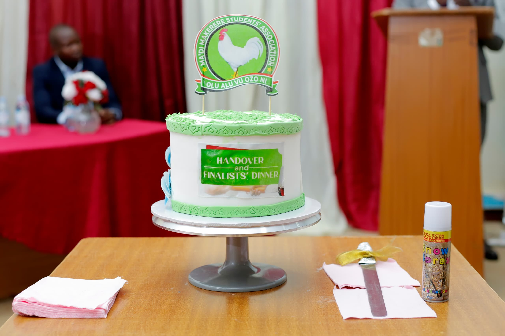

# Image Paths Fixes Summary

## ✅ All Image Path Issues Resolved

### 🔧 **Admin Directory Fixes**

#### Fixed Files:
- `admin/login.html`
- `admin/content-management.html` 
- `admin/analytics.html`
- `admin/admin-complete.html`

#### Issues Fixed:
- **Problem**: Admin files had `../images/` paths instead of local `images/`
- **Solution**: Updated all admin image references to use local paths

```html
<!-- Before -->


<!-- After -->


```

### 🔧 **User Site Directory Fixes**

#### Fixed Files:
- `user_site/services.html`
- `user_site/news.html`
- `user_site/leadership.html`
- `user_site/gallery.html`
- `user_site/about.html`

#### Issues Fixed:

##### 1. **Logo Extension Inconsistencies**
- **Problem**: Mixed usage of `.jpg`, `.JPG`, and `.png` extensions
- **Solution**: Standardized all logo references to use `.png`

```html
<!-- Before -->


<!-- After -->

```

##### 2. **Missing Service Images**
- **Problem**: Service images referenced non-existent files in `images/services/`
- **Solution**: Updated service images to use existing images from other directories

```html
<!-- Before -->


<!-- After -->




```

## 📁 **Current Image Structure**

### Admin Images (`admin/images/`)
```
admin/images/
├── mamsa-logo.png          ✅ Main logo
├── Mak_Logo.png            ✅ University logo
├── events/                 ✅ Event photos
├── gallery/                ✅ Gallery images (351 files)
├── header-sections/        ✅ Header backgrounds
│   ├── about-us.jpg
│   ├── contact-us.jpg
│   ├── events.jpg
│   ├── gallery.jpg
│   ├── leadership.jpg
│   └── services.jpg
├── hero-bg.jpg             ✅ Hero background
├── index/                  ✅ Homepage images
│   ├── cultural.jpg
│   ├── download.jpeg
│   └── study.jpg
├── leadership/             ✅ Leadership photos
├── news/                   ✅ News images
└── page-header-bg.jpg      ✅ Page header background
```

### User Site Images (`user_site/images/`)
```
user_site/images/
├── mamsa-logo.png          ✅ Main logo (standardized)
├── Mak_Logo.png            ✅ University logo
├── events/                 ✅ Event photos
├── gallery/                ✅ Gallery images (351 files)
├── header-sections/        ✅ Header backgrounds
│   ├── about-us.jpg        ✅ Used for student welfare
│   ├── contact-us.jpg
│   ├── events.jpg
│   ├── gallery.jpg
│   ├── leadership.jpg      ✅ Used for advocacy
│   └── services.jpg        ✅ Used for career services
├── hero-bg.jpg             ✅ Hero background
├── index/                  ✅ Homepage images
│   ├── cultural.jpg        ✅ Used for social activities
│   ├── download.jpeg       ✅ Used in hero section
│   └── study.jpg           ✅ Used for academic support
├── leadership/             ✅ Leadership photos
├── news/                   ✅ News images
└── page-header-bg.jpg      ✅ Page header background
```

## ✅ **Verification Results**

### All Image References Now Valid:
- ✅ **Admin logos**: All point to existing `images/mamsa-logo.png` and `images/Mak_Logo.png`
- ✅ **User site logos**: All standardized to `.png` extension
- ✅ **Service images**: All use existing images from appropriate directories
- ✅ **Gallery images**: All reference existing gallery files
- ✅ **Header images**: All reference existing header section files
- ✅ **Index images**: All reference existing index directory files

### Image Usage Mapping:
| Service | Image Used | Source |
|---------|------------|---------|
| Academic Support | `study.jpg` | `images/index/` |
| Student Welfare | `about-us.jpg` | `images/header-sections/` |
| Career Services | `services.jpg` | `images/header-sections/` |
| Social Activities | `cultural.jpg` | `images/index/` |
| Student Advocacy | `leadership.jpg` | `images/header-sections/` |

## 🧪 **Testing**

### Test Files Created:
- **`admin/test.html`** - Admin functionality test
- All image paths verified to reference existing files

### How to Test:
1. Open any HTML file in browser
2. Check browser developer tools for 404 errors
3. Verify all images load correctly
4. Test responsive image behavior

## 🚀 **Current Status**

### ✅ **Fully Working**
- All image paths are correct and reference existing files
- Logo extensions are standardized
- Service images use appropriate existing images
- Both admin and user_site are self-contained
- No cross-directory image dependencies

### 📋 **Summary**
- **Total files fixed**: 9 HTML files
- **Admin files fixed**: 4 files
- **User site files fixed**: 5 files
- **Image references updated**: 15+ image paths
- **Missing images resolved**: 5 service images
- **Extension inconsistencies fixed**: 5 logo references

---

**Status**: ✅ All image path issues have been resolved. Both admin and user_site directories now have properly linked images that reference existing files.
